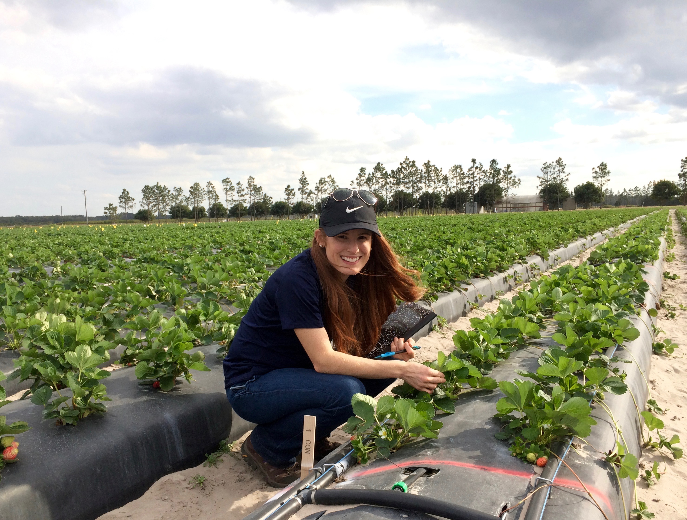

```{r setup, include=FALSE}
knitr::opts_chunk$set(echo = TRUE, fig.pos = 'H')
```
\

```{r, echo=FALSE, out.width = "300px", fig.align='center'}

```


<link rel="stylesheet" href="styles.css" type="text/css">


## Biography
 I am currently a PhD student in [Karen Garrett's Lab](http://www.garrettlab.com) in the department of plant pathology at the University of Florida. I'm interested in providing data-driven solutions to growers and other agricultural stakeholders. In my current research we use network models to understand the spread of plant disease epidemics in the landscape to help inform management stratigies for emerging epidemics. Check out my most recent publications for a better idea of what I've been up to recently and - of course- follow me on twitter!
 
***


## Research Interests  


* Plant disease epidemiology  
* Field crop pathology 
* Network modeling  
* Yield loss modeling
* Landscape epidemiology  
* Healthy seed systems  
* Emerging plant pathogens
* International Agriculture

***

<!-- <div style= "position: relative; left: 350px; right: 200px; top: -250px; bottom: 100px;"> -->
<!--    -->
<!-- </div> -->

## Publications 

* Andersen, K. F., C. E. Buddenhagen, P. Rachkara, R. Gibson, S. Kalule, D. Phillips, and K. A. Garrett. 2019. Analyzing key nodes and epidemic risk in seed networks: Sweetpotato in Northern Uganda. Phytopathology. Published Online (First Look): Feb 20th, 2019. DOI: 10.1094/PHYTO-03-18-0072-R

* Delaquis, E., K. F. Andersen, N. Minato, C. T. L. Thuy, M. E. Karssenberg, S. Sophearith, K. A. G. Wyckhuys, J. Newby, D. D. Burra, P. Srean, I. Phirun, L. D. Niem, P. T. Nhan, K. A. Garrett, C. J. M. Almekinders, P. C. Struik, S. de Haan. 2018. Raising the stakes: cassava seed networks at multiple scales in Cambodia and Vietnam.  Frontiers in Sustainable Food Systems. 2:73.

* Garrett, K. A., R. I. Alcalá-Briseño, K. F. Andersen, C. E. Buddenhagen, R. A. Choudhury, J. C. Fulton, J. F. Hernandez Nopsa, R. Poudel, and Y. Xing. 2018. Network analysis: A systems framework to address grand challenges in plant pathology.  Annual Review of Phytopathology 

* Garrett, K. A., K. F. Andersen, F. Asche, R. L. Bowden, G. A. Forbes, P. A. Kulakow, and B. Zhou. 2017. Resistance genes in global crop breeding networks. Phytopathology 107:  https://doi.org/10.1094/PHYTO-03-17-0082-FI

* Buddenhagen*, C. E.,  J. F. Hernandez Nopsa*, K. F. Andersen, J. Andrade-Piedra, G. A. Forbes, P. Kromann, S. Thomas-Sharma, P. Useche, and K. A. Garrett. 2017. Epidemic network analysis for mitigation of invasive pathogens in seed systems: Potato in Ecuador. Phytopathology. 

* Andersen, K. F., Madden, L. V., Paul, P.A. 2015. Fusarium Head Blight Development and Deoxynivalenol Accumulation in Wheat as Influenced by Post-Anthesis Moisture Patterns. Phytopathology. 105:210-219. 

* Andersen, K. F. Morris, L., Derksen, R. C., Madden, L. V. and Paul, P. A. 2014. Rainfastness of Prothioconazole + Tebuconazole for Fusarium Head Blight and Deoxynivalenol Management in Soft Red Winter Wheat. Plant Disease. 98:1398-1406. 

* Andersen, K. F. and Ospina-Giraldo, M.D. 2011. Assessment of the effect of temperature on the late blight disease cycle using a detached leaf assay. Journal of the Pennsylvania Academy of Science. 85:165-173. 

* Andersen, K. F. and Ospina-Giraldo, M.D. 2011. Relative disease susceptibility of cultivated varieties of potato to different isolates of Phytophthora infestans. Journal of the Pennsylvania Academy of Science. 85:140-146. 


